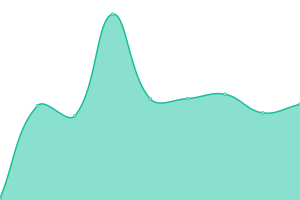

# [📈 Live Status](https://uptime.shamm.as): <!--live status--> **🟧 Partial outage**

This repository contains the open-source uptime monitor and status page for [geprgyp](https://uptime.shamm.as), powered by [Upptime](https://github.com/upptime/upptime).

With [Upptime](https://upptime.js.org), you can get your own unlimited and free uptime monitor and status page, powered entirely by a GitHub repository. We use [Issues](https://github.com/geprgyp/uptime.shamm.as/issues) as incident reports, [Actions](https://github.com/geprgyp/uptime.shamm.as/actions) as uptime monitors, and [Pages](https://uptime.shamm.as) for the status page.

<!--start: status pages-->
<!-- This summary is generated by Upptime (https://github.com/upptime/upptime) -->
<!-- Do not edit this manually, your changes will be overwritten -->
<!-- prettier-ignore -->
| URL | Status | History | Response Time | Uptime |
| --- | ------ | ------- | ------------- | ------ |
|  [Ifconfig.io](https://ifconfig.io) | 🟩 Up | [ifconfig-io.yml](https://github.com/georgyo/uptime.shamm.as/commits/master/history/ifconfig-io.yml) | 

 140ms
     
 | 

<a href="https://uptime.shamm.as/history/ifconfig-io">100.00%</a>
    

|  [NYCResistor Wiki](https://wiki.nycresistor.com) | 🟩 Up | [nyc-resistor-wiki.yml](https://github.com/georgyo/uptime.shamm.as/commits/master/history/nyc-resistor-wiki.yml) | 

 306ms
     
 | 

<a href="https://uptime.shamm.as/history/nyc-resistor-wiki">100.00%</a>
    

|  [Google](https://www.google.com) | 🟩 Up | [google.yml](https://github.com/georgyo/uptime.shamm.as/commits/master/history/google.yml) | 

 61ms
     
 | 

<a href="https://uptime.shamm.as/history/google">100.00%</a>
    

|  [Wikipedia](https://en.wikipedia.org) | 🟩 Up | [wikipedia.yml](https://github.com/georgyo/uptime.shamm.as/commits/master/history/wikipedia.yml) | 

 65ms
     
 | 

<a href="https://uptime.shamm.as/history/wikipedia">100.00%</a>
    

|  [Hacker News](https://news.ycombinator.com) | 🟩 Up | [hacker-news.yml](https://github.com/georgyo/uptime.shamm.as/commits/master/history/hacker-news.yml) | 

 415ms
     
 | 

<a href="https://uptime.shamm.as/history/hacker-news">100.00%</a>
    

|  [Broken Site](https://thissitedoesnotexist.com) | 🟥 Down | [broken-site.yml](https://github.com/georgyo/uptime.shamm.as/commits/master/history/broken-site.yml) | 

 0ms
     
 | 

<a href="https://uptime.shamm.as/history/broken-site">100.00%</a>
    

<!--end: status pages-->

[**Visit our status website →**](https://uptime.shamm.as)

## 📄 License

- Powered by: [Upptime](https://github.com/upptime/upptime)
- Code: [MIT](./LICENSE) © [geprgyp](https://uptime.shamm.as)
- Data in the `./history` directory: [Open Database License](https://opendatacommons.org/licenses/odbl/1-0/)
