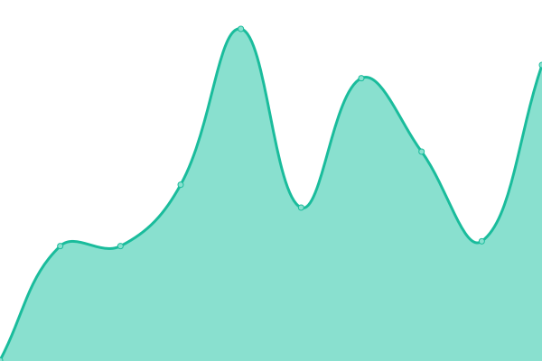

# [📈 Live Status](https://uptime.shamm.as): <!--live status--> **🟩 All systems operational**

This repository contains the open-source uptime monitor and status page for [georgyo](https://uptime.shamm.as), powered by [Upptime](https://github.com/upptime/upptime).

With [Upptime](https://upptime.js.org), you can get your own unlimited and free uptime monitor and status page, powered entirely by a GitHub repository. We use [Issues](https://github.com/georgyo/uptime.shamm.as/issues) as incident reports, [Actions](https://github.com/georgyo/uptime.shamm.as/actions) as uptime monitors, and [Pages](https://uptime.shamm.as) for the status page.

<!--start: status pages-->
<!-- This summary is generated by Upptime (https://github.com/upptime/upptime) -->
<!-- Do not edit this manually, your changes will be overwritten -->
<!-- prettier-ignore -->
| URL | Status | History | Response Time | Uptime |
| --- | ------ | ------- | ------------- | ------ |
|  [Ifconfig.io](https://ifconfig.io) | 🟩 Up | [ifconfig-io.yml](https://github.com/georgyo/uptime.shamm.as/commits/HEAD/history/ifconfig-io.yml) | 

 285ms
     
 | 

<a href="https://uptime.shamm.as/history/ifconfig-io">100.00%</a>
    

|  [NYCResistor Wiki](https://wiki.nycresistor.com) | 🟩 Up | [nyc-resistor-wiki.yml](https://github.com/georgyo/uptime.shamm.as/commits/HEAD/history/nyc-resistor-wiki.yml) | 

 782ms
     
 | 

<a href="https://uptime.shamm.as/history/nyc-resistor-wiki">97.72%</a>
    

|  [NYCResistor Blog](https://www.nycresistor.com/) | 🟩 Up | [nyc-resistor-blog.yml](https://github.com/georgyo/uptime.shamm.as/commits/HEAD/history/nyc-resistor-blog.yml) | 

 426ms
     
 | 

<a href="https://uptime.shamm.as/history/nyc-resistor-blog">100.00%</a>
    

|  [NYCR Matrix Synapse](https://nycr.chat/_matrix/static/) | 🟩 Up | [nycr-matrix-synapse.yml](https://github.com/georgyo/uptime.shamm.as/commits/HEAD/history/nycr-matrix-synapse.yml) | 

 248ms
     
 | 

<a href="https://uptime.shamm.as/history/nycr-matrix-synapse">100.00%</a>
    

|  [NYCR Mastodon](https://nycr.social/api/v1/streaming/health) | 🟩 Up | [nycr-mastodon.yml](https://github.com/georgyo/uptime.shamm.as/commits/HEAD/history/nycr-mastodon.yml) | 

 147ms
     
 | 

<a href="https://uptime.shamm.as/history/nycr-mastodon">100.00%</a>
    

|  [Shamm.as](https://shamm.as) | 🟩 Up | [shamm-as.yml](https://github.com/georgyo/uptime.shamm.as/commits/HEAD/history/shamm-as.yml) | 

 222ms
     
 | 

<a href="https://uptime.shamm.as/history/shamm-as">97.72%</a>
    

|  [Nowossjolka](https://nowossjolka.com/) | 🟩 Up | [nowossjolka.yml](https://github.com/georgyo/uptime.shamm.as/commits/HEAD/history/nowossjolka.yml) | 

 540ms
     
 | 

<a href="https://uptime.shamm.as/history/nowossjolka">97.55%</a>
    

<!--end: status pages-->

[**Visit our status website →**](https://uptime.shamm.as)

## 📄 License

- Powered by: [Upptime](https://github.com/upptime/upptime)
- Code: [MIT](./LICENSE) © [georgyo](https://uptime.shamm.as)
- Data in the `./history` directory: [Open Database License](https://opendatacommons.org/licenses/odbl/1-0/)
